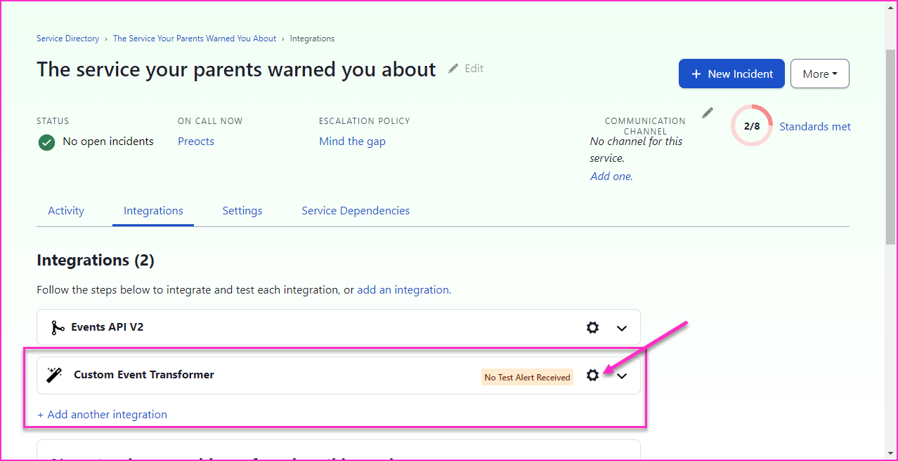
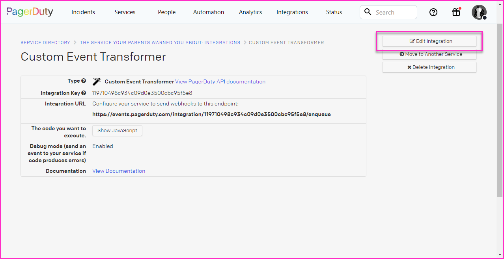
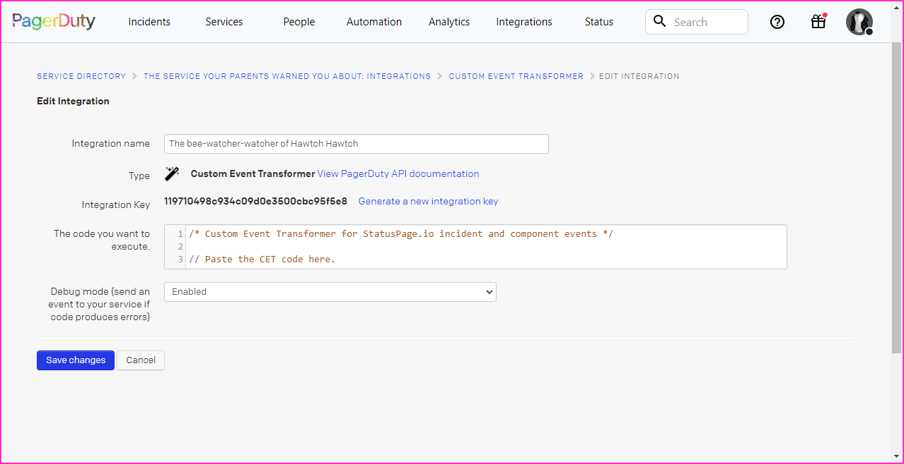

# Status Page Webhook

## Custom Event Transformer

A Custom Event Transformer (CET) to allow alerting for incidents emitted from
PagerDuty's external status page or status.io status page. Captures key details
from the webhook. Deduplicates additonal alerts by default. Auto resolve of
incident is enabled by default.

External links:

- [PagerDuty Custom Event
  Transformer](https://developer.pagerduty.com/docs/events-api-v1/custom-event-transformer/)
- [PagerDuty External Status Page
  Documents](https://support.pagerduty.com/docs/external-status-page#example-payload)
- [Statuspage.io webhook
  documentation](https://support.atlassian.com/statuspage/docs/enable-webhook-notifications/)

### Note about PagerDuty Status Page webhooks:

Planned as of July 12th 2023 PagerDuty will be migrating their status page from
status.io to their own external status page. This CET consumes **both** styles
of webhooks.

---

### Configuration

There are three vars that can be adjusted to change the behavior of this CET.

- **open_incident**
  - When set to 'true' the CET will transform incoming incident webhooks into an
    alert which will open an incident unless otherwise stopped by Event
    Orchestration.
  - Default: `true`

- **dedup_events**
  - When set to `true` the CET will create an `incident_key` from the contents
    of the webhook to prevent additional incidents from opening as long as the
    original remains open.
  - **Note**: When false, auto-resolve is not possible.
  - Default: `true`

- **auto_resolve**
  - When set to 'true' incidents will auto-resolve in PagerDuty when a status of
    'resolved' is recieved from the webhook.
  - Default: `true`

- **component_incidents**
  - For statuspage.io alerts only
  - When set to 'true' the CET will transform incoming component webhooks into
    an alert which will open an incident unless otherwise stopped by Event
    Orchestration.
  - Default: `false`

---

### Installation

1. Select the desired service's Integrations tab and add a "Custom Event
   Transformer" integration. Click the gear to configure the integration.

2. Note the integration URL, this is where to route the webhooks. 
3. Click "Edit Integration"

4. Name the integration, if desired
5. Paste the contents of the
   [`cet_statuspage_webhooks.js`](cet_statuspage_webhooks.js) into the code
   field.
6. Enable/Disable debugging as desired

### Testing

You can test the CET integration by sending the sample payloads in the links
provided at the top of this file to the integration's URL.
